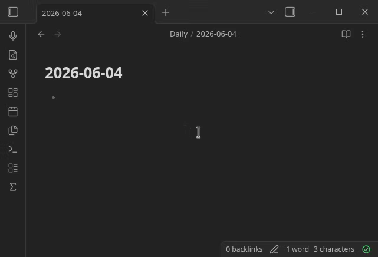

# LaTeX Symbol Picker

An Obsidian side panel to find LaTeX symbols by **drawing** them (or searching),
then insert them at the cursor. It auto-wraps the command in `$...$` when the
cursor is not already inside a math context.

It works **fully offline**: the classifier and its training data ship with the
plugin. Only symbols that Obsidian's MathJax can render are included.

## Usage

- Open the panel from the ribbon (sigma icon) or the command
  "LaTeX Symbol Picker: Open panel".
- Draw a symbol on the canvas, or type part of a command in the search box.
- Click a result to insert it at the cursor in the active note.

## Credits & license

This plugin is MIT licensed. It is built on the MIT-licensed
[Detexify](https://github.com/kirel/detexify) project by Daniel Kirsch: the
classifier in `src/classifier.ts` is a TypeScript port, and the bundled data is
derived from the Detexify data set. See [`LICENSE`](LICENSE) for the license and
[`NOTICE`](NOTICE) for third-party attribution.
